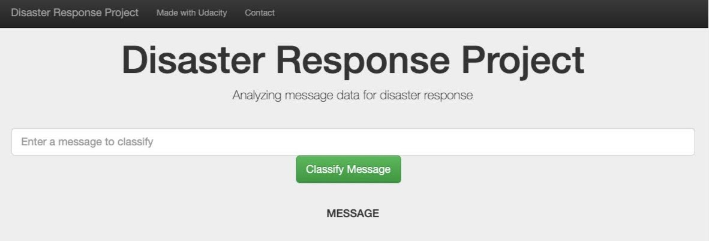
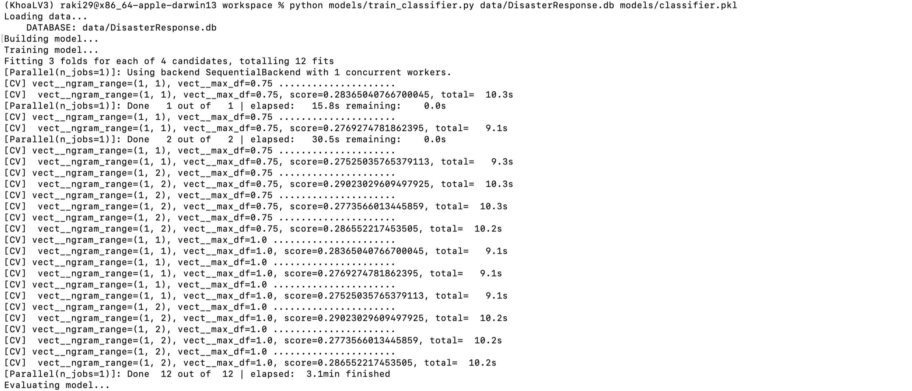
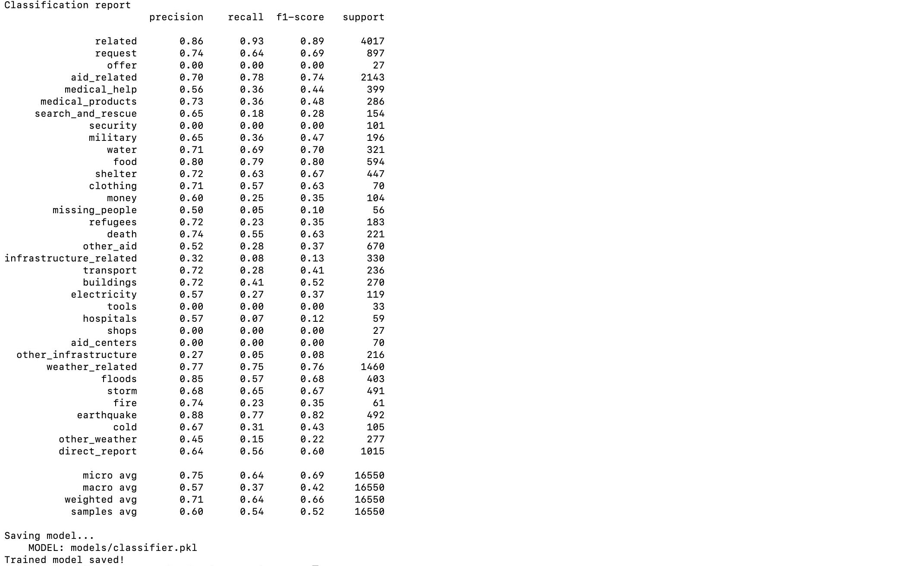
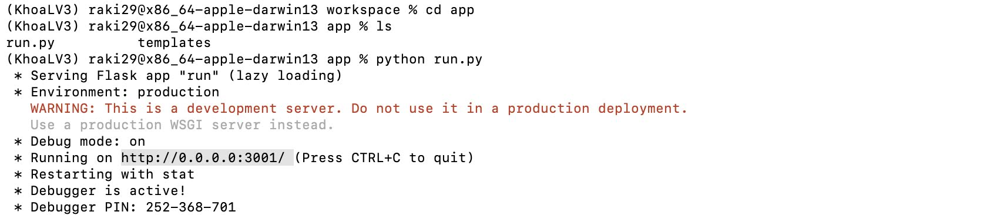
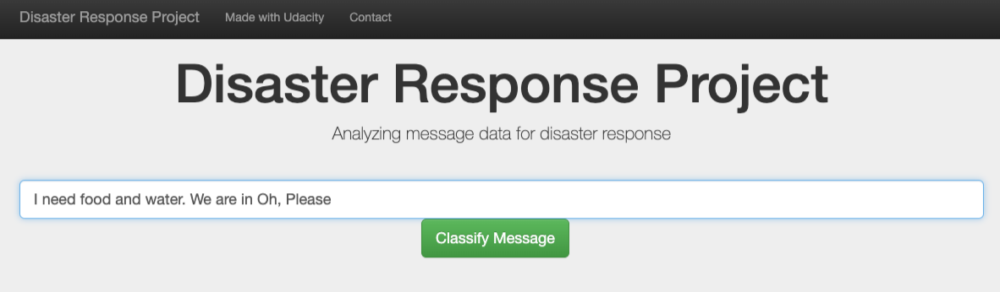
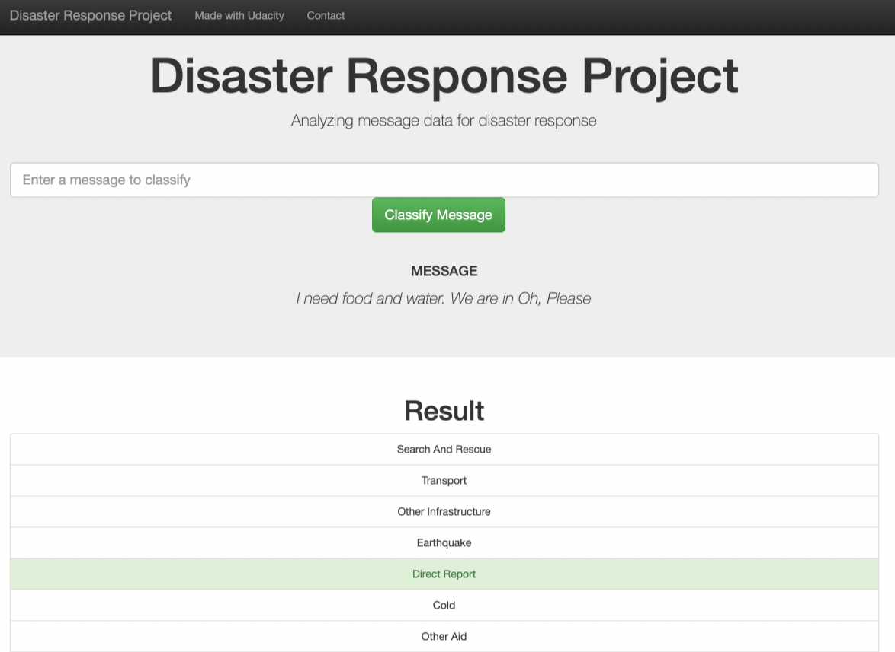
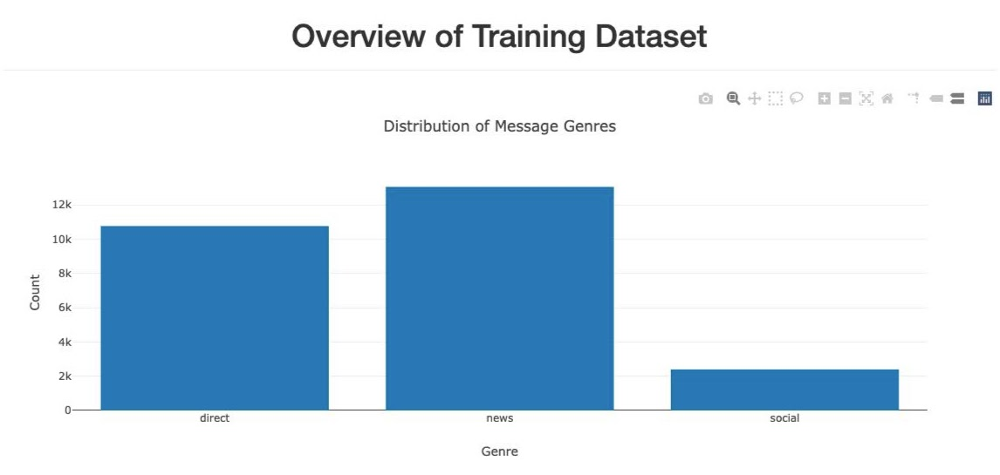
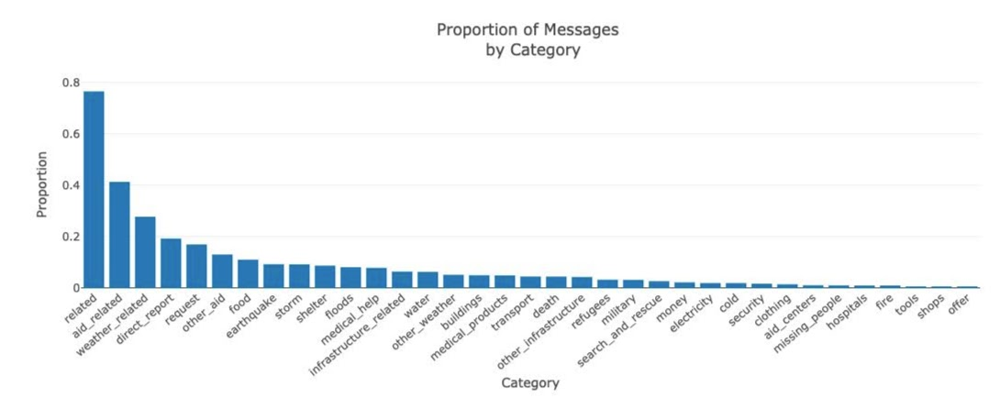

# Project 2 : Disaster ResponsePipelines (Udacity)

## 1. Description
This project goal is to create a machine learning pipeline to classify disaster events from a dataset provided by [Figure Eight](https://appen.com/) containing real messages.

This project will include a web app where an emergency worker can input a new message and get classification results in several categories. The web app will also display visualizations of the data.
## 2. Project Components
There are three components of this project:

### 2.1. ETL Pipeline
File *data/process_data.py* contains data cleaning pipeline that:

* Loads the **messages** and **categories** dataset
* Merges the two datasets
* Cleans the data
* Stores it in a **SQLite database**

### 2.2. ML Pipeline
File *models/train_classifier.py* contains machine learning pipeline that:

* Loads data from the **SQLite database**
* Splits the data into training and testing sets
* Builds a text processing and machine learning pipeline
* Trains and tunes a model using GridSearchCV
* Outputs result on the test set
* Exports the final model as a pickle file

### 2.3. Flask Web App

* Modify file paths for database and model as needed
* Add data visualizations using Plotly in the web app

## 3. Installation
* Python 3.5+
* Machine Learning Libraries: NumPy, SciPy, Pandas, Sciki-Learn
* Natural Language Process Libraries: NLTK
* SQLlite Database Libraqries: SQLalchemy
* Model Loading and Saving Library: Pickle
* Web App and Data Visualization: Flask, Plotly

## 4. Executing Program
- Run the following commands in the project's directory to set up the database, train model and save the model.

  - To run ETL pipeline to clean data and store the processed data in the database python data/process_data.py data/disaster_messages.csv data/disaster_categories.csv data/disaster_response_db.db
  - To run the ML pipeline that loads data from DB, trains classifier and saves the classifier as a pickle file python models/train_classifier.py data/disaster_response_db.db models/classifier.pkl

- Run the following command in the app's directory to run your web app. python run.py

- Go to http://0.0.0.0:3001/

## 5. Screenshots
**Sample run of train_classifier.py**

**Sample run of run.py**

**This is an example of a message we can type to test the performance of the model**

**What the app will do is that it will classify the text message into categories so that appropriate relief agency can be reached out for help**

**Some information about training data set as seen on the main page of the web app**

## 6. File Description
**app/templates/\***: html files for web app

**app/run.py** : Flask Web App

**data/DisaterResponse.db** : database to save cleaned data to

**data/messages.csv**: contains the id, message and genre, i.e. the method (direct, social, ...) the message was sent

**data/categories.csv**: contains the id and the categories (related, offer, medical assistance..) the message belonges to

**data/process_data.py** : ETL pipeline

**models/classifier.pkl** : saved model

**models/train_classifier.py** : ML Pipeline

**Screenshots**

**README.md**

## 7. Licensing, Authors, Acknowledgments
This project has been completed as part of the **Data Science Nanodegree** on [Udacity](https://www.udacity.com/). 
The data was collected by [Figure Eight](https://appen.com/) and provided by [Udacity](https://www.udacity.com/).

